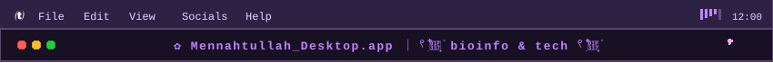
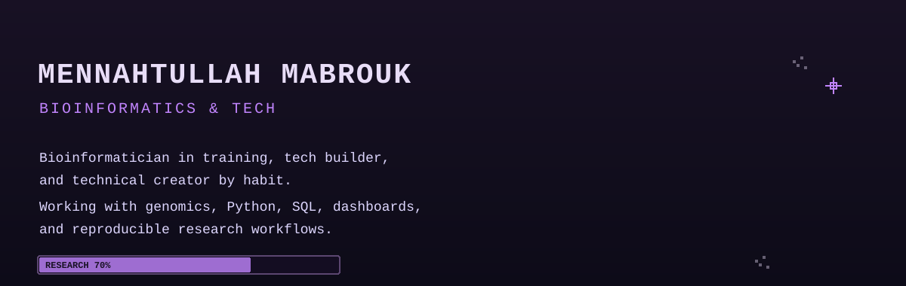
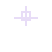
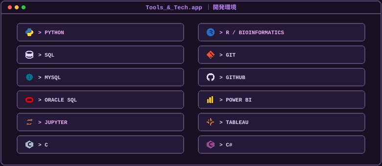
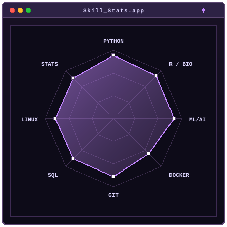

  

<table align="center" width="850" style="border-collapse: collapse; border: 2px solid #5B4670; background-color: #181124;">
<tr>
<td align="center" bgcolor="#181124">

 

  

&nbsp;&nbsp;&nbsp;&nbsp;

 

&nbsp;

&nbsp;

&nbsp;

&nbsp;

&nbsp;

&nbsp;

 

  

<table align="center" width="780" style="border-collapse: collapse;">
<tr>
<td align="center" width="50%">

</td>
<td align="center" width="50%">

</td>
</tr>
<tr>
<td align="center" width="50%">

</td>
<td align="center" width="50%">

  
<code>> every commit feeds the snake.app</code>
</td>
</tr>
</table>

  
<code>[ SYSTEM: ONLINE ] &nbsp;|&nbsp; [ STATUS: ACTIVE ] &nbsp;|&nbsp; [ MODE: MACOS ]</code>
  

</td>
</tr>
</table>
